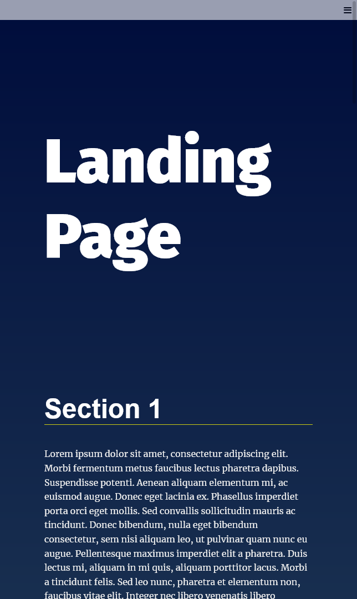
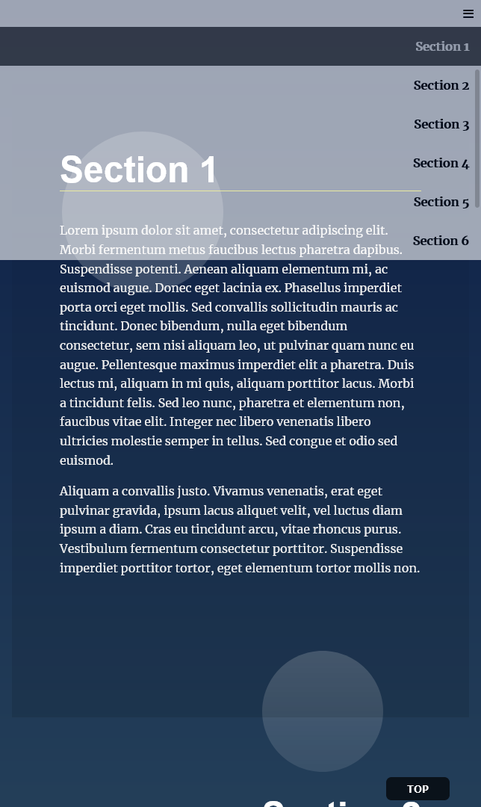

# Landing Page Project

This is the solution of [Landing Page Project]. First project of web development professional track.

## Table of contents

- [Overview](#overview)
  - [The challenge](#the-challenge)
  - [Screenshot](#screenshot)

## Overview

using what I have learned from this track so far (JavaScript and DOM manipulation) - Build the navigation menu - Add functionality to distinguish the section in view - Add the functionality to scroll to sections. - Add scroll to top button - Build a responsive navigation menu

### The challenge

Users should be able to:

- See responsive nav bar for mobile, tablet and large screens
- See dynamic nav menu that changes with respect to the number of sections in the page
- See active state section and the respected link

### Screenshot

- navigation bar
  

-section 1 is active while in the viewport

- Responsive nav bar
  <<<<<<< HEAD
  )
  )
  =======

  
  
<<<<<<< HEAD
=======

>>>>>>> a3c304d95953602b3799d69961f8b05359e37281
