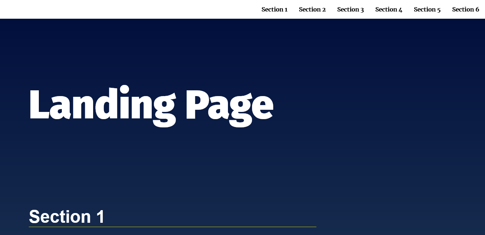
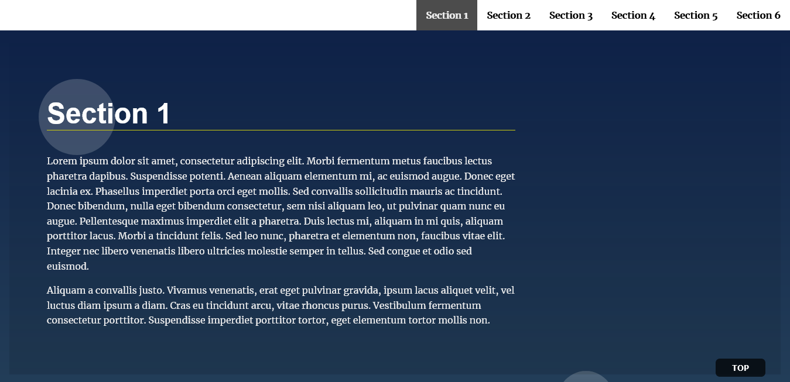

# Landing Page Project

This is the solution of [Landing Page Project]. First project of web development professional track.

## Table of contents

- [Overview](#overview)
  - [The challenge](#the-challenge)
  - [Screenshot](#screenshot)
  - [Links](#links)
- [My process](#my-process)
  - [What I learned](#what-i-learned)

## Overview

using what I have learned from this track so far (JavaScript and DOM manipulation) - Build the navigation menu - Add functionality to distinguish the section in view - Add the functionality to scroll to sections. - Add scroll to top button - Build a responsive navigation menu

### The challenge

Users should be able to:

- See responsive nav bar for mobile, tablet and large screens
- See dynamic nav menu that changes with respect to the number of sections in the page
- See active state section and the respected link

### Screenshot

- navigation bar
  

-section 1 is active while in the viewport


### Links

- Live Site URL: [Add live site URL here](https://your-live-site-url.com)

## My process

### What I learned

I have learned to use intersection observer API to observe each section and toggle a css class each time the section is in the viewport

The Part of code to observe each section and toggle the css class:

````
```js

const sectioOptions = {
    threshold: 0.7
};

const sectionObserver = new IntersectionObserver(function (entries) {
    entries.forEach(entry => {
        let anchor = document.getElementById(entry.target.id);
        if (!entry.isIntersecting) {
            /** if the target section is not in the viewport,
             * remove active class from section and from related link */
            entry.target.classList.remove("your-active-class");
            anchor.classList.remove("your-active-class")
        } else {
            /** else add active class from section and from related link */
            entry.target.classList.add("your-active-class");
            anchor.classList.add("your-active-class")
        }
    })
}, sectioOptions)
}
````

### Useful resources

- [Kevin Powell youtube page](https://www.youtube.com/watch?v=T8EYosX4NOo&ab_channel=KevinPowell) - This helped me to understand intersection observer API with practicale example.
- [MDN Web documentation](https://developer.mozilla.org/en-US/docs/Web/API/Intersection_Observer_API) - This is the documentation in the mdn page
